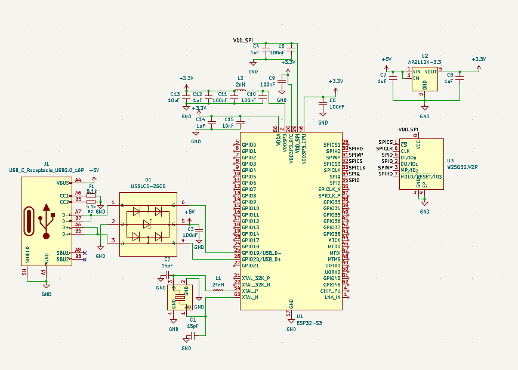

# 3rd of September: Schematic setup

I set up the schematic with the ESP32-S3, various power filtering, LDO, USB C, ESD protection array and a winbond 32mbit flash.
I plan on making the antenna setup next for wireless applications or maybe I will look into a basic ceramic SMD antenna.

**Total time spent: 1.5 hours**
